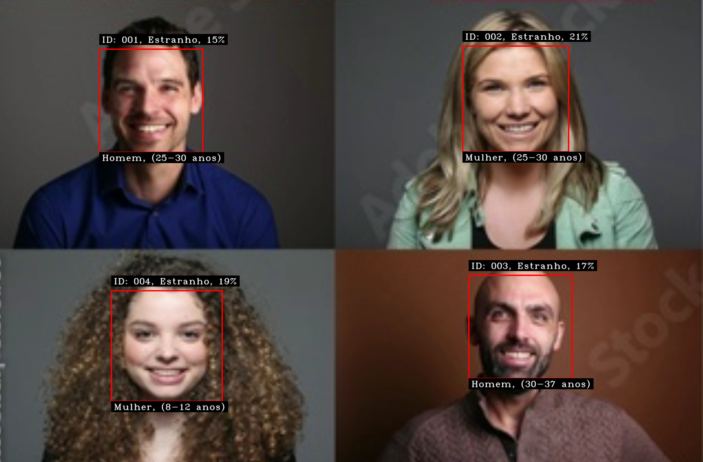

# FaceScanId

## Projeto de Detecção e Reconhecimento Facial

Este projeto utiliza a biblioteca OpenCV em Python para criar um sistema avançado de detecção e reconhecimento facial. Ele abrange desde a captura de imagens faciais até o treinamento de modelos de reconhecimento facial e a detecção em tempo real, incluindo previsões de gênero e idade.

<p align="center">
    
</p>

---

## O que é Visão Computacional?

Visão Computacional é o campo que permite aos computadores verem e identificarem imagens e vídeos digitais de maneira semelhante aos humanos. Isso inclui a aquisição, processamento, análise e compreensão de imagens digitais para extrair dados significativos do mundo real, úteis para tomadas de decisão. As aplicações típicas envolvem reconhecimento de objetos, rastreamento de movimento e restauração de imagens.

---

## Sobre o Projeto

Este projeto em Python utiliza técnicas avançadas de Deep Learning para identificar com precisão o sexo e a idade de uma pessoa a partir de uma única imagem facial. Os modelos utilizados foram treinados por Tal Hassner e Gil Levi. O sistema prevê o gênero como 'Masculino' ou 'Feminino' e a idade em faixas que variam de (0–2) até (60–100).

<p align="center">
    
</p>

---

## Estrutura do Projeto

- **Captura de Imagens Faciais**: Captura fotos de faces através de uma webcam e as armazena com informações de identificação.
- **Treinamento de Modelos**: Treina modelos de reconhecimento facial utilizando as imagens capturadas.
- **Reconhecimento em Tempo Real**: Detecta e reconhece faces em tempo real, realizando previsões de gênero e idade.

---

## Arquivos Principais

1. **cadastro.py**: Script para captura de imagens faciais e armazenamento das informações.
2. **treinamento.py**: Script para treinamento dos modelos de reconhecimento facial.
3. **reconhecedor.py**: Script para reconhecimento facial em tempo real com previsões de gênero e idade.

---

## Instalação

1. Crie um ambiente virtual para isolar suas bibliotecas Python:

    ```bash
    python -m venv venv
    ```

2. Ative o ambiente virtual:

    ```bash
    source venv/bin/activate  # no Windows use 'venv\Scripts\activate'
    ```

3. Instale as dependências do projeto:

    - Python 3.x
    - OpenCV
    - NumPy
    - Colorama

    Instale as dependências com:

    ```bash
    pip install numpy opencv-python colorama
    ```

    ou

    ```bash
    pip install -r requirements.txt
    ```

---

## Como Usar

### Captura de Imagens Faciais

1. Execute o script `cadastro.py`:
    ```bash
    python cadastro.py
    ```
2. Insira um identificador e um nome quando solicitado.
3. O script capturará 70 fotos do seu rosto e as armazenará no diretório `fotos`.

Durante a execução deste script, o programa captura automaticamente 70 imagens da face detectada. Para cada face capturada, você deverá fornecer um ID e um nome:

- **ID**: Identificador numérico único associado à pessoa. Se for um estranho, o sistema atribuirá um ID iniciado com "00".
- **Nome**: Nome da pessoa correspondente ao ID fornecido.

Por exemplo, para capturar o rosto de João com ID 1, insira:

```
ID: 1
Nome: João
```

Se a pessoa for desconhecida, o sistema atribuirá automaticamente um ID iniciado com "00".

O sistema salvará as imagens capturadas associadas ao ID e nome fornecidos.

### Treinamento dos Modelos

1. Execute o script `treinamento.py`:
    ```bash
    python treinamento.py
    ```
2. O script treinará o modelo de reconhecimento facial LBPH e salvará os classificadores no diretório `classifier`.

### Reconhecimento em Tempo Real

1. Execute o script `reconhecedor.py`:
    ```bash
    python reconhecedor.py
    ```
2. O script iniciará a captura de vídeo, detectará e reconhecerá faces em tempo real, além de prever gênero e idade.

Durante a execução deste script, o sistema detectará rostos em tempo real, tentará identificar a pessoa com base nas imagens capturadas e treinadas anteriormente, além de estimar o gênero e a idade de cada rosto detectado.

<p align="center">
    
</p>

---

## Descrição dos Scripts

### cadastro.py

Este script utiliza a webcam para capturar imagens faciais. Ele:
- Detecta faces e olhos utilizando Haarcascades.
- Armazena imagens faciais em tons de cinza no diretório `fotos`.
- Verifica se o ID já existe e atualiza ou retorna um erro.

### treinamento.py

Este script treina o algoritmo de reconhecimento facial utilizando o método LBPH (Local Binary Patterns Histograms).

### reconhecedor.py

Este script realiza o reconhecimento facial em tempo real e prevê o gênero e a idade. Ele:
- Utiliza o classificador LBPH para reconhecimento facial.
- Utiliza redes neurais treinadas para previsão de gênero e idade.
- Exibe informações no vídeo, incluindo ID, nome, confiança, gênero e idade.

---

## Estrutura de Diretórios

```
projeto/
│
├── cascade/
│   ├── haarcascade_frontalface_default.xml
│   └── haarcascade-eye.xml
│
├── classifier/
│   └── classificadorLBPH.yml
│
├── modelos/
│   ├── opencv_face_detector.pbtxt
│   ├── opencv_face_detector_uint8.pb
│   ├── age_deploy.prototxt
│   ├── age_net.caffemodel
│   ├── gender_deploy.prototxt
│   └── gender_net.caffemodel
│
├── fotos/
│   └── (imagens capturadas)
│
├── cadastro.py
├── treinamento.py
└── reconhecedor.py
```

---

## Parâmetros Ajustáveis

Este projeto permite ajustar vários parâmetros para atender às suas necessidades específicas. Abaixo estão os principais parâmetros que você pode configurar:

### Script `cadastro.py`

- **Número de Fotos Capturadas**: Define quantas fotos de rosto são capturadas por pessoa durante o processo de cadastro.

    ```python
    NUM_FOTOS = 70  # Número de fotos capturadas por pessoa
    ```
    - Um maior número de fotos e um algoritmo mais refinado resultarão em um melhor reconhecimento dos rostos cadastrados. Quanto mais imagens forem fornecidas ao modelo, melhor ele se tornará. Recomendo, para uma boa detecção, no mínimo 70 imagens; para uma excelente detecção, 100 imagens.

### Script `reconhecedor.py`

- **Escala da Janela de Detecção (`scaleFactor`)**: Controla a taxa de escala pela qual a imagem é reduzida em cada nível da pirâmide de imagem durante a detecção de rostos.

    ```python
    scaleFactor = 1.3  # Escala da janela de detecção
    ```

    - **Resumo**: O `scaleFactor` afeta a sensibilidade da detecção de rostos. Valores mais altos tornam o sistema menos sensível a rostos pequenos ou distantes, o que pode melhorar o desempenho, reduzindo falsas detecções. Valores mais baixos aumentam a sensibilidade, permitindo detectar rostos menores ou distantes, mas aumentando o tempo de processamento.

- **Número de Vizinhos (`minNeighbors`)**: Define quantos vizinhos cada candidato a retângulo de detecção deve ter para ser considerado como um rosto válido.

    ```python
    minNeighbors = 5  # Número de vizinhos
    ```

    - **Resumo**: O `minNeighbors` influencia diretamente na precisão da detecção de rostos. Valores mais altos reduzem o número de detecções falsas ao exigir uma confirmação maior de vizinhos para cada detecção. Valores mais baixos aumentam o número de detecções, o que pode ser útil para detectar rostos menos distintos, mas aumenta o risco de falsas detecções.

- **Limiar de Confiança (`limiar_confianca`)**: Define o limite de confiança para reconhecer um rosto como correspondente a um usuário cadastrado.

    ```python
    limiar_confianca = 65  # Limiar de confiança
    ```

    - **Resumo**: O `limiar_confianca` determina quão seguro o sistema deve estar para reconhecer um rosto como correspondente a um usuário cadastrado. Ajustar esse valor afeta diretamente a precisão do reconhecimento facial e pode ajudar a controlar o número de falsas identificações.

Esses ajustes permitem personalizar o comportamento do projeto conforme suas preferências e necessidades específicas. Para mais detalhes, consulte os comentários no código de cada script.

---

## Construído Com

* [OpenCV](https://pypi.org/project/opencv-contrib-python/) - OpenCV
* [NumPy](https://numpy.org/) - NumPy
* [Python](https://www.python.org/) - Python
* [Colorama](https://pypi.org/project/colorama/) - Colorama

* e outros

## Autor

* **Lukas** - [lukas.py](https://github.com/lukas8484)

---

## Contribuições

Contribuições são bem-vindas! Sinta-se à vontade para enviar pull requests ou relatar problemas.

---

## Licença

Este projeto está licenciado sob a MIT License.

---